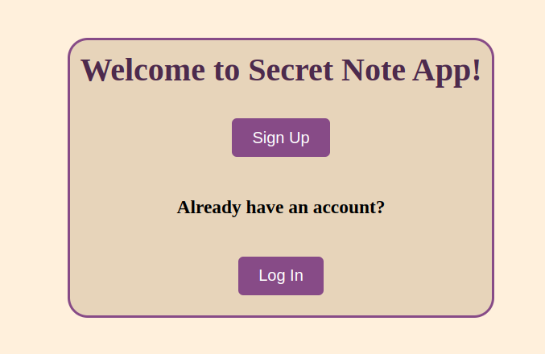

# Secret-Note Application

This repository implements a Secret Note Sharing Application, it's a web application that allows users to securely share self-destructing secret notes.

The notes are created with a random url that can't be easily guessed, has self destruction feature using maximum views or expiration time

## Table of Contents

- [features](#features)
- [Installation](#installation)
- [Usage](#usage)

## Features
- Note Creation :

    - Users can create a note with text content
    - Generate a unique, secure URL for each note
    - Set an expiration time or number of views before destruction
- Note Retrieval :

    - Users can view a note using the unique URL
    - After viewing or upon expiration, the note is permanently deleted
- Security Features:

    - We use secure random generation for URLs so that the urls aren't predictable

## Installation

Clone the repository

   ```bash
   git clone https://github.com/codescalersinternships/Secret-Note-MVC-Rawan-Mostafa.git
   ```

## Usage
Run the docker container using docker-compose
```bash
    docker-compose up
```
You'll then find the url of your app printed in the terminal, and here you go you can signup and start making notes securely!

